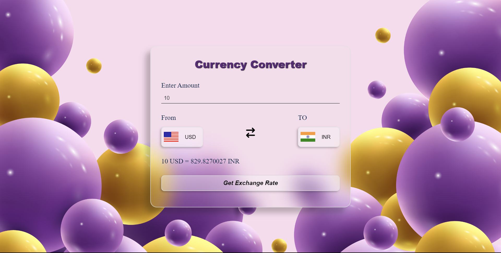

# Currency Exchange Project

This project is a simple currency exchange application built with Html, Css and JavaScript, Exchange Rate API.

## Description

The Currency Exchange Project allows users to convert between different currencies at the current exchange rate. It utilizes a third-party API to fetch the latest exchange rates.

## Features

- Real-time Exchange Rates: Utilizes up-to-date exchange rate data to ensure accuracy.
- Multiple Currency Support: Supports a wide range of currencies for conversion.
- User-Friendly Interface: Designed with simplicity and ease of use in mind.
